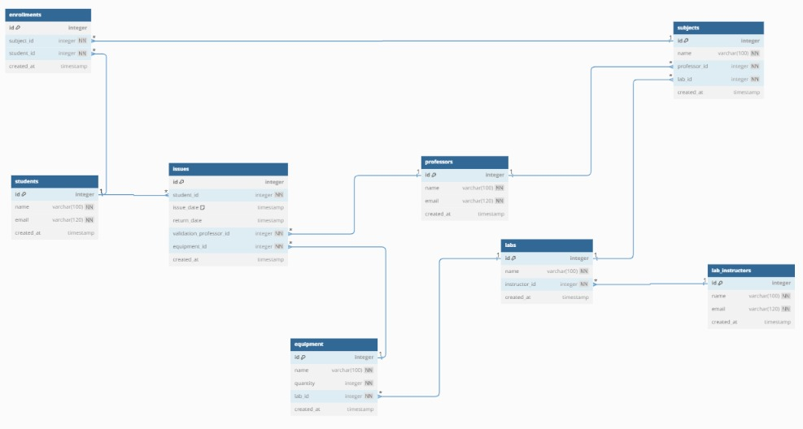

Student: Represents students with their details and enrollments.
Professor: Represents professors who validate equipment issues.
LabInstructor: Represents lab instructors managing labs.
Subject: Represents subjects taught by professors and associated with specific labs.
Lab: Represents labs managed by instructors, containing equipment.
Equipment: Represents lab equipment with quantities.
Enrollment: Represents the enrollment of students in subjects.
Issue: Represents equipment issues by students, validated by professors.
Relationships:
Student ↔ Enrollment (One-to-Many)
Professor ↔ Subject (One-to-Many)
LabInstructor ↔ Lab (One-to-Many)
Lab ↔ Subject (One-to-Many)
Lab ↔ Equipment (One-to-Many)
Subject ↔ Enrollment (One-to-Many)
Equipment ↔ Issue (One-to-Many)
Student ↔ Issue (One-to-Many)
Professor ↔ Issue (One-to-Many)
